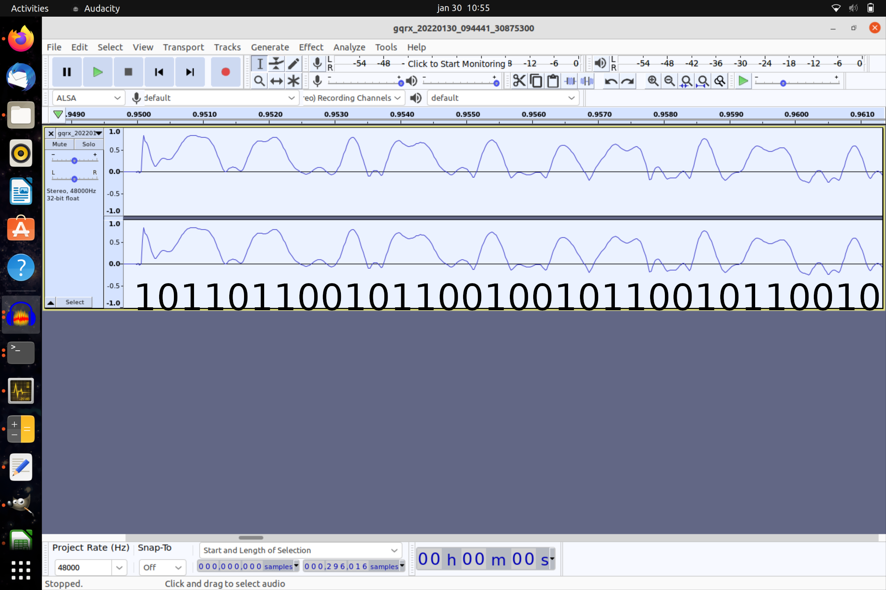

# The KeyClone Project

## Introduction

After university, I moved into a collocation with some friends. The owner had allowed me a spot in his garage to park my motorcycle. The only issue was that the garage door was controlled with an old and single remote (something of [this](https://www.remotecontrol-express.com/remote+NICE+:+FLO1+OLD) type). In order to allow both of the owner and myself to access the garage, we had to share the remote key. This was pretty annoying and unsafe. Therefore, I decided to clone the remote key using my Raspberry Pi (this was way more fun that just buying a new remote).

This project details the main steps I went thought while doing this project. It also provides the code used for cloning the garage door remote.

## Reverse engineering the old remote

I bought a small SDR (somehting of [this](https://www.amazon.com.be/-/nl/SDR-ontvanger-full-band-ontvanger-RTL-SDR-radio-gedefinieerd-communicatiesysteem/dp/B08DDDVWFD/ref=asc_df_B08DDDVWFD/?hvadid=633370450780&hvpos=&hvnetw=g&hvrand=6136675819701338683&hvpone=&hvptwo=&hvqmt=&hvdev=c&hvdvcmdl=&hvlocint=&hvlocphy=20058&hvtargid=pla-1210215135834&psc=1) type) and analyzed the signal produced by the remote using [Gqrx](https://gqrx.dk/) on my Ubuntu laptop.

First step was to find out the carrier frequency. When installed close to the SDR antenna, the signal was pretty easy to spot as it produced a high and wide peak in the spectrum. I localized the signal around 27 MHz.

I could bring the signal in baseband (for further analysis) using the amplitude modulation parameter in Gqrx (the digital signal from the remote was a simple binary ASK). I recorded multiple samples of the signal and saw that everytime the same code was sent to the door. This major security breach made this project way more simple than I thought it would be.

I used Audacity to determine the code sent by the remote :



The radio frequency parameters were determined (carrier frequency, modulation type) together with the modulation signal. I could start with the next step of the project : generating the signal from my cloned remote.

## Turning my Raspberry Pi into a garage door remote

At the time I was not interested to invest much time in the harware side of my projects. Therefore I tried to create a clone of the remote with as little effort as possible. When browsing GitHub, I found out this wonderful repository : [rpitx](https://github.com/F5OEO/rpitx).

Rpitx is a library that exploits the internal clock of the Raspberry Pi to generate signals directly on the GPIO pin 4. The only disadvantage is that the square form of the carrier wave consequently pollutes a large part of the spectrum with high energy harmonics. This can however be resolved by using a pass band filter.

It took some time to resolve wich part of the library was best suited to generate the desired signal. After some hours of search, the On Off Keying (OOK) command of the library seemed to contain the functionnalities I was looking for.

## Opening the garage door with my cloned remote key

It took some trials and parameter tuning to have it to work but I finally had found the command that replicated the original signal close enough :

```
sudo sendook -f 26.9946M -0 368 -1 368 -p 12082 -r 11 1011001011011001011001001011001011001
```

The above command instructs the Raspberry pi to generate an On Off Keying signal with carrier frequency 26.9946 MHz, 368 µs pulse duration, 11 bursts and 12082 µs pause between each of them.

I created a very simple code (maybe too simplistic) in bash that looped over this command. The file containing the useful code (tx.sh) is launched from the bashrc file at each start up. I connected my Pi to a battery on my bike. Whenever I approched the door of the garage, it opened automatically ! No need to remove a glove to press a button. Even better, I had my own key to open the garage door. No need to share one with the appartment owner.

## Closing Remarks

I never took the time to go deeper in this project. This was partly due to the fact that I moved in an other appartement shortly after I finished the big part of the project. For security reasons, it would have been important to change the code of ```tx.sh``` and only send the commmand when approaching the door or when pressing a custom button on the handlebar. This to avoid a replay attack.

